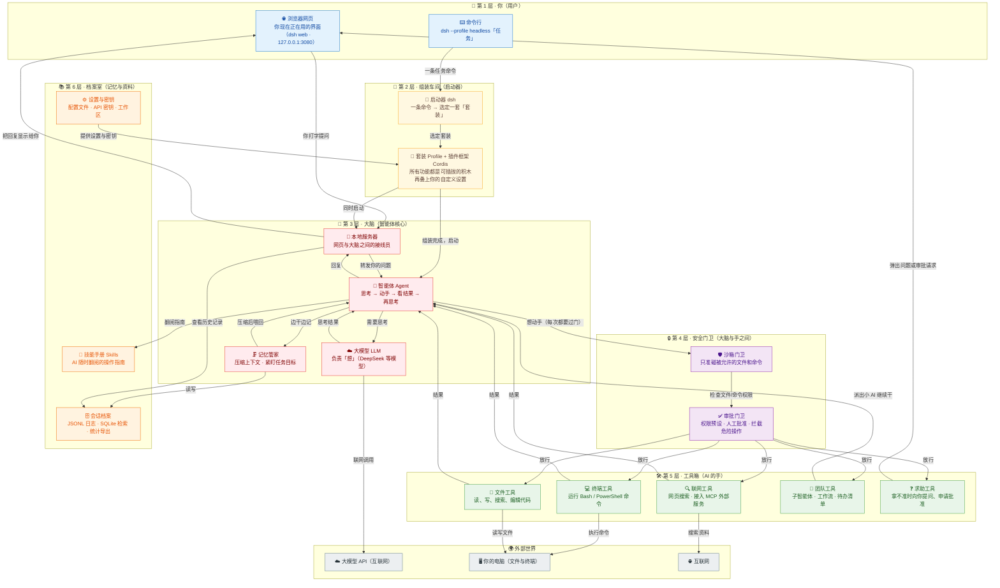

```mermaid
flowchart TB
    %% ═══════════ 第 1 层：用户 ═══════════
    subgraph U["🙋 第 1 层 · 你（用户）"]
        WEB["🌐 浏览器网页<br/>你现在正在用的界面<br/>（dsh web · 127.0.0.1:3080）"]
        CLI["⌨️ 命令行<br/>dsh --profile headless「任务」"]
    end

    %% ═══════════ 第 2 层：组装车间 ═══════════
    subgraph BOOT["🚀 第 2 层 · 组装车间（启动器）"]
        LAUNCH["🚪 启动器 dsh<br/>一条命令 → 选定一套「套装」"]
        ASSEMBLY["🧩 套装 Profile + 插件框架 Cordis<br/>所有功能都是可插拔的积木<br/>再叠上你的自定义设置"]
    end

    %% ═══════════ 第 3 层：大脑 ═══════════
    subgraph CORE["🧠 第 3 层 · 大脑（智能体核心）"]
        SERVER["📡 本地服务器<br/>网页与大脑之间的接线员"]
        AGENT["🤖 智能体 Agent<br/>思考 → 动手 → 看结果 → 再思考"]
        LLM["☁️ 大模型 LLM<br/>负责「想」（DeepSeek 等模型）"]
        MEMORY["🗜️ 记忆管家<br/>压缩上下文 · 紧盯任务目标"]
    end

    %% ═══════════ 第 4 层：安全门卫 ═══════════
    subgraph SAFE["🔒 第 4 层 · 安全门卫（大脑与手之间）"]
        SANDBOX["🛡️ 沙箱门卫<br/>只准碰被允许的文件和命令"]
        PERM["✅ 审批门卫<br/>权限预设 · 人工批准 · 拦截危险操作"]
    end

    %% ═══════════ 第 5 层：工具箱 ═══════════
    subgraph TOOLS["🛠️ 第 5 层 · 工具箱（AI 的手）"]
        TERM["💻 终端工具<br/>运行 Bash / PowerShell 命令"]
        FS["📁 文件工具<br/>读、写、搜索、编辑代码"]
        NET["🔍 联网工具<br/>网页搜索 · 接入 MCP 外部服务"]
        TEAM["👥 团队工具<br/>子智能体 · 工作流 · 待办清单"]
        ASK["❓ 求助工具<br/>拿不准时向你提问、申请批准"]
    end

    %% ═══════════ 第 6 层：档案室 ═══════════
    subgraph STORE["📚 第 6 层 · 档案室（记忆与资料）"]
        ARCHIVE["🗄️ 会话档案<br/>JSONL 日志 · SQLite 检索 · 统计导出"]
        SKILL["📖 技能手册 Skills<br/>AI 随时翻阅的操作指南"]
        CFG["⚙️ 设置与密钥<br/>配置文件 · API 密钥 · 工作区"]
    end

    %% ═══════════ 外部世界 ═══════════
    subgraph OUT["🌍 外部世界"]
        API["☁️ 大模型 API（互联网）"]
        MACHINE["🖥️ 你的电脑（文件与终端）"]
        INTERNET["🌐 互联网"]
    end

    %% ── 你 ↔ 界面 ──
    WEB -->|"你打字提问"| SERVER
    SERVER -->|"把回复显示给你"| WEB
    CLI -->|"一条任务命令"| LAUNCH

    %% ── 组装启动 ──
    LAUNCH -->|"选定套装"| ASSEMBLY
    ASSEMBLY -->|"组装完成，启动"| AGENT
    ASSEMBLY -->|"同时启动"| SERVER
    CFG -->|"提供设置与密钥"| ASSEMBLY

    %% ── 大脑内部 ──
    SERVER -->|"转发你的问题"| AGENT
    AGENT -->|"回复"| SERVER
    AGENT -->|"需要思考"| LLM
    LLM -->|"思考结果"| AGENT
    LLM -->|"联网调用"| API
    AGENT -->|"边干边记"| MEMORY
    MEMORY -->|"压缩后喂回"| AGENT
    MEMORY -->|"读写"| ARCHIVE
    SERVER -->|"查看历史记录"| ARCHIVE
    AGENT -->|"翻阅指南"| SKILL

    %% ── 门卫 ──
    AGENT -->|"想动手（每次都要过门）"| SANDBOX
    SANDBOX -->|"检查文件/命令权限"| PERM
    PERM -->|"放行"| TERM
    PERM -->|"放行"| FS
    PERM -->|"放行"| NET
    PERM -->|"放行"| TEAM
    PERM -->|"放行"| ASK

    %% ── 手 → 外部世界 / 结果回传 ──
    TERM -->|"执行命令"| MACHINE
    FS -->|"读写文件"| MACHINE
    NET -->|"搜索资料"| INTERNET
    TEAM -->|"派出小 AI 继续干"| AGENT
    ASK -->|"弹出问题或审批请求"| WEB
    TERM -->|"结果"| AGENT
    FS -->|"结果"| AGENT
    NET -->|"结果"| AGENT

    %% ── 配色 ──
    classDef user  fill:#e3f2fd,stroke:#1976d2,color:#0d47a1
    classDef boot  fill:#fff8e1,stroke:#f9a825,color:#5d4037
    classDef core  fill:#ffebee,stroke:#e53935,color:#7f0000
    classDef safe  fill:#f3e5f5,stroke:#8e24aa,color:#4a148c
    classDef tools fill:#e8f5e9,stroke:#43a047,color:#1b5e20
    classDef store fill:#fff3e0,stroke:#ef6c00,color:#e65100
    classDef ext   fill:#eceff1,stroke:#607d8b,color:#263238
    class WEB,CLI user
    class LAUNCH,ASSEMBLY boot
    class SERVER,AGENT,LLM,MEMORY core
    class SANDBOX,PERM safe
    class TERM,FS,NET,TEAM,ASK tools
    class ARCHIVE,SKILL,CFG store
    class API,MACHINE,INTERNET ext
```

---

> 所属：[[资源库总览]] › [[模板与工具]] ｜ 返回：[[00-主页|主页]]
> 同专题：[[怎么进行演讲]] · [[模板与工具]]
